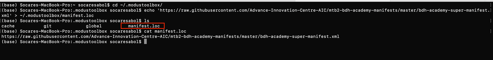
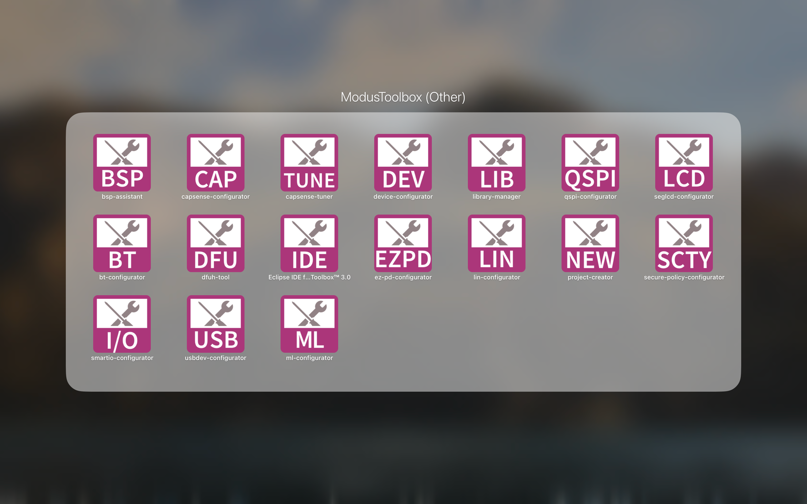
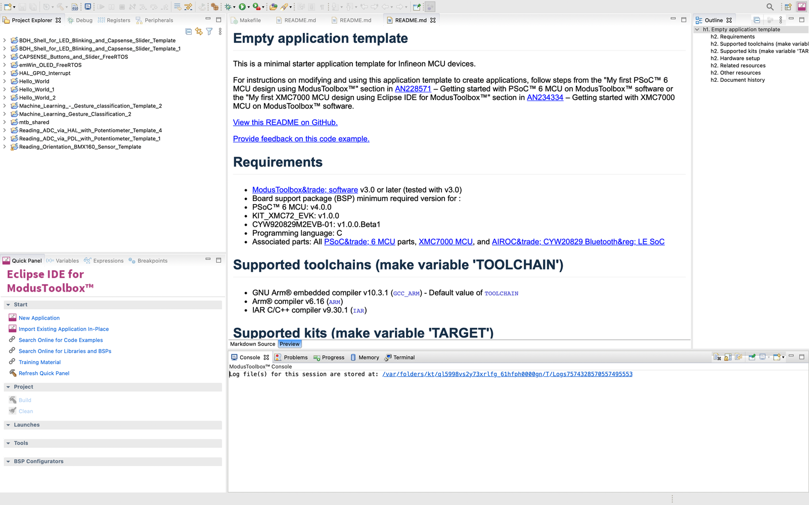

# Development Enviroment Preparation
## 1. ModusToolbox Installation and Firmware Updates
### 1.1 ModusToolbox Installation
#### 💻 System Requirement

    - Windows 7 64-bit / Windows 10 64-bit
    - macOS10.x
    - UbuntuLinux18LTS

#### 📀 Download the Software
Go to the Cypress ModusToolbox website (www.cypress.com/modustoolbox) and download your appropriate software from your platform: 

    - Windows:ModusToolbox_1.1.0.<build>-windows-install.exe
    - Linux:ModusToolbox_1.1.0.<build>-linux-install.tar.gz
    - macOS:ModusToolbox_1.1.0.<build>-osx-install.pkg


### 1.2 Firmware Updates
#### 💻 For MacOS
##### Checking fw’s version
```
$ cd /Applications/ModusToolbox/tools_3.0/fw-loader/bin/
$ ./fw-loader --device-list
```


##### Update firmware
```
$ ./fw-loader --update-kp3
```


#### For Windowns 
Open modus-shell 


### 1.3 Adding the BDH Code Template
```
$ cd 
$ cd ~/.modustoolbox/
$ echo 'https://raw.githubusercontent.com/Advance-Innovation-Centre-AIC/mtb2-bdh-academy-manifests/master/bdh-academy-super-manifest.xml' > ~/.modustoolbox/manifest.loc
```


## 2. Eclipse IDE Development Tools and Project Creator
### 1. Open ModusToolbox Tool 


### 2. Click Eclipse IDE for ModbusToolbox



