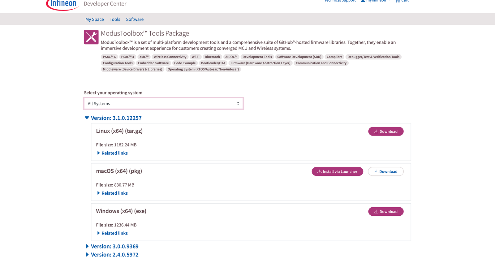
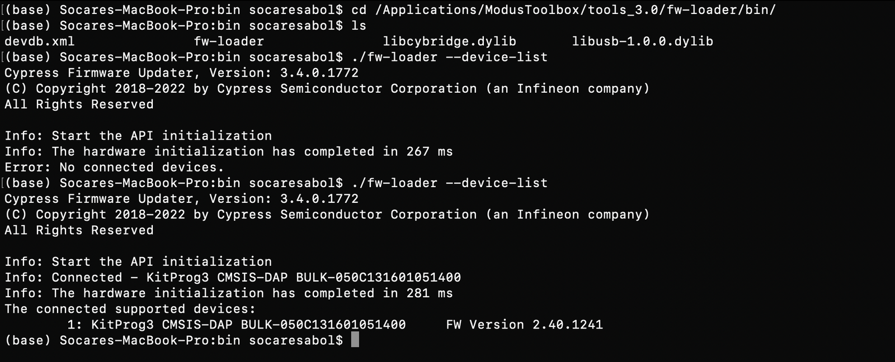
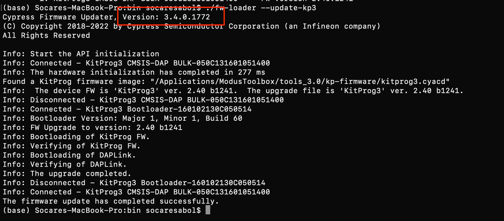
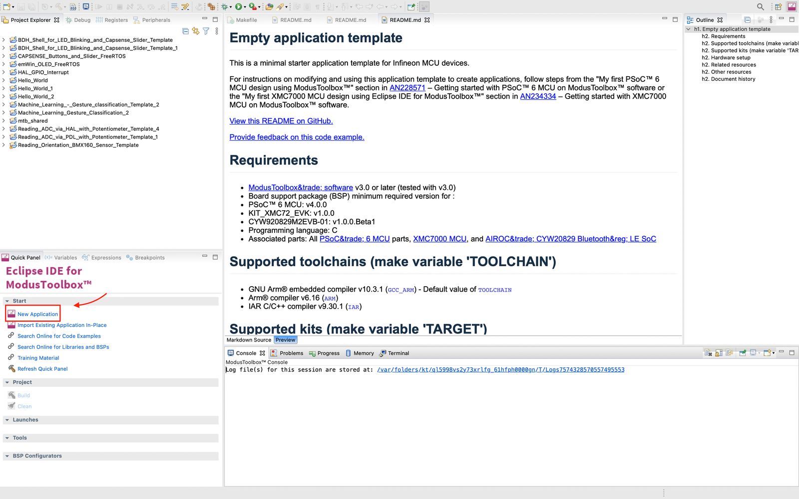
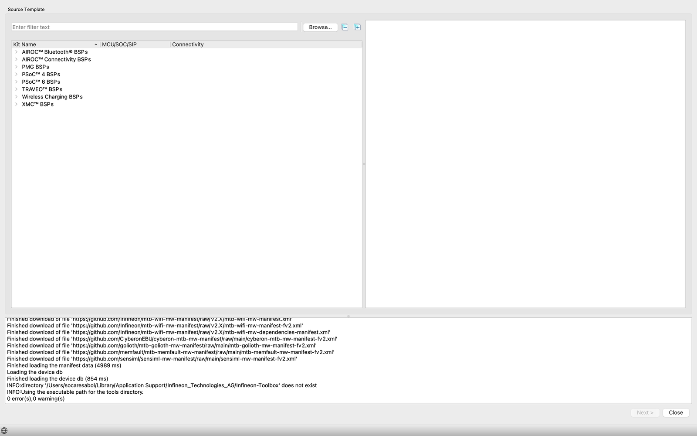
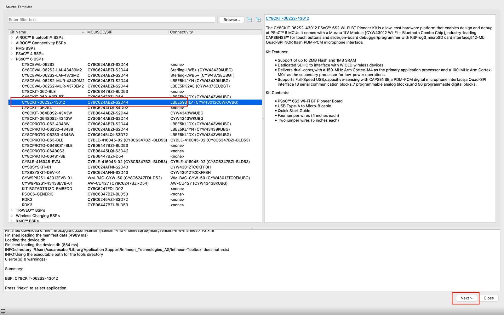
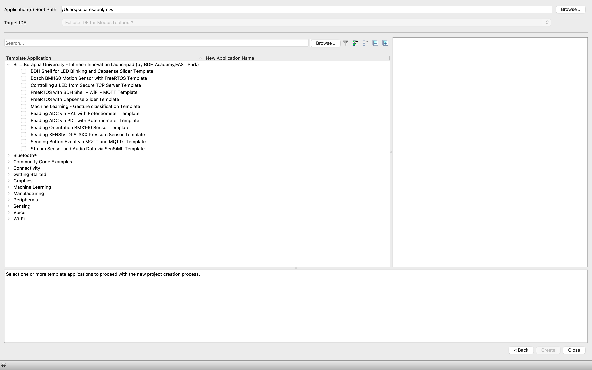
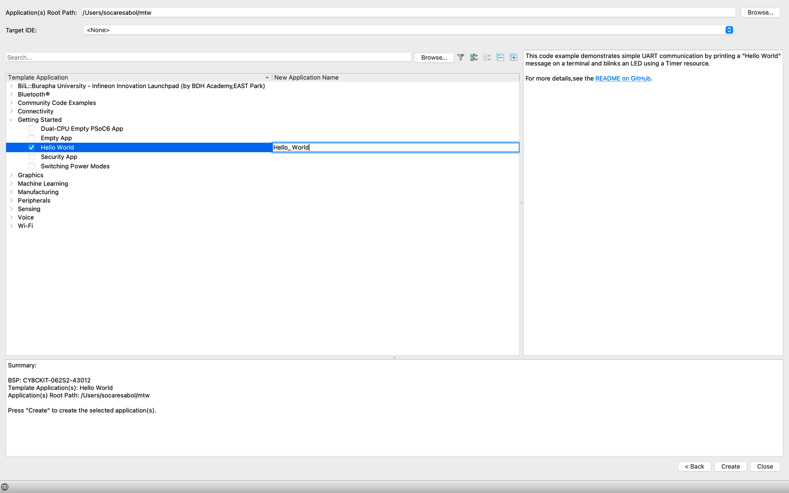
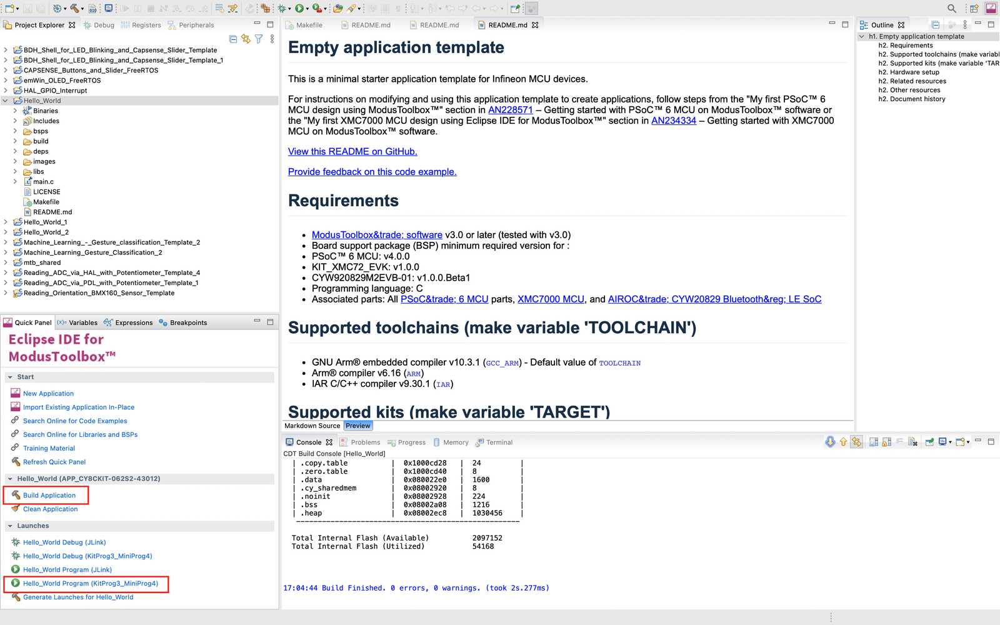

# Development Enviroment Preparation
## 1. ModusToolbox Installation and Firmware Updates
### 1.1 ModusToolbox Installation
#### 💻 System Requirement

    - Windows 7 64-bit / Windows 10 64-bit
    - macOS10.x
    - UbuntuLinux18LTS

#### 📀 Download the Software
Go to the Cypress ModusToolbox website (www.cypress.com/modustoolbox) and download your appropriate software from your platform: 

    - Windows:ModusToolbox_1.1.0.<build>-windows-install.exe
    - Linux:ModusToolbox_1.1.0.<build>-linux-install.tar.gz
    - macOS:ModusToolbox_1.1.0.<build>-osx-install.pkg



### 1.2 Firmware Updates
#### 💻 For MacOS
##### Checking fw’s version
```
$ cd /Applications/ModusToolbox/tools_3.0/fw-loader/bin/
$ ./fw-loader --device-list
```


##### Update firmware
```
$ ./fw-loader --update-kp3
```


#### For Windowns 
Open modus-shell 


### 1.3 Adding the BDH Code Template
```
$ cd 
$ cd ~/.modustoolbox/
$ echo 'https://raw.githubusercontent.com/Advance-Innovation-Centre-AIC/mtb2-bdh-academy-manifests/master/bdh-academy-super-manifest.xml' > ~/.modustoolbox/manifest.loc
```


## 2. Eclipse IDE Development Tools and Project Creator
### 1. Open ModusToolbox Tool 


### 2. Click Eclipse IDE for ModbusToolbox


### 3. Click “New Application ” and it will automatically shell to Project Creator 2.0


### 4. Click “PSoC6 BSP s” and  following the below step

### 5. Go to “Getting Started”



## 3. “Hello World and LED Blinking” Programming.
### 1. Choose “Hello World” project and you can setting any name you want 

### 2. Building and running project by click 
`Build Application` —> `[Project_Name] Program (KitProg3_MiniProg4)`



