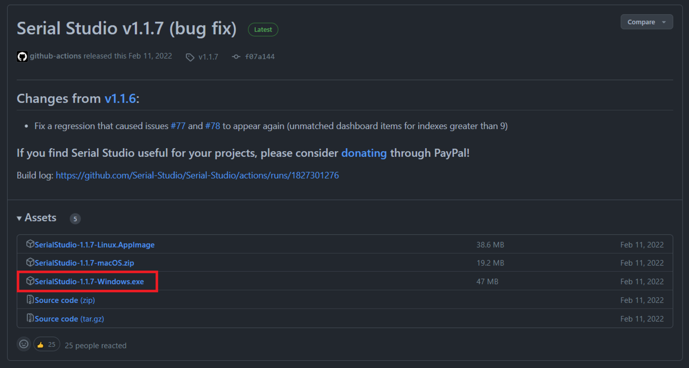

# Development Enviroment Preparation
## 1. ModusToolbox Installation and Firmware Updates
### 1.1 ModusToolbox Installation
#### 💻 System Requirement

    - Windows 7 64-bit / Windows 10 64-bit
    - macOS10.x
    - UbuntuLinux18LTS

#### 📀 Download the Software
Go to the Cypress ModusToolbox website (www.cypress.com/modustoolbox) and download your appropriate software from your platform: 

    - Windows:ModusToolbox_1.1.0.<build>-windows-install.exe
    - Linux:ModusToolbox_1.1.0.<build>-linux-install.tar.gz
    - macOS:ModusToolbox_1.1.0.<build>-osx-install.pkg


### 1.2 Firmware Updates
Connect the board to the Host Machine


#### 💻 For MacOS
-  Checking fw’s version
```
$ cd /Applications/ModusToolbox/tools_3.0/fw-loader/bin/
$ ./fw-loader --device-list
```


- Update firmware
```
$ ./fw-loader --update-kp3
```


#### 🖥️ For Windowns 
- Open modus-shell
  
  

- Change the directory to ModusToolbox/tools_3.0/fw-loader/bin/.
```
$ cd ModusToolbox/tools_3.0/fw-loader/bin/
$ ./fw-loader --device-list
```


- Adding the BDH Code Template:
```
echo 'https://raw.githubusercontent.com/Advance-Innovation-Centre-AIC/mtb2-bdh-academy-manifests/master/bdh-academy-super-manifest.xml' > ~/.modustoolbox/manifest.loc
```
### 1.3 Adding the BDH Code Template
```
$ cd 
$ cd ~/.modustoolbox/
$ echo 'https://raw.githubusercontent.com/Advance-Innovation-Centre-AIC/mtb2-bdh-academy-manifests/master/bdh-academy-super-manifest.xml' > ~/.modustoolbox/manifest.loc
```


## 2. Eclipse IDE Development Tools and Project Creator
### 2.1. Open ModusToolbox Tool 


### 2.2. Click Eclipse IDE for ModbusToolbox


### 2.3. Click “New Application ” and it will automatically shell to Project Creator 2.0


### 2.4. Click “PSoC6 BSP s” and  following the below step

### 2.5. Go to “Getting Started”


## 3. “Hello World and LED Blinking” Programming.
### 3.1. Choose “Hello World” project and you can setting any name you want 

### 3.2. Building and running project by click 
`Build Application` —> `[Project_Name] Program (KitProg3_MiniProg4)`


# 🧮 Serial Studio Installation.
## 💻 For windows 
- 👉 Go to Serial Studio download link: https://serial-studio.github.io/#download and click on `Install`. 


- 👉 Choose `SerialStudio-1.1.7-Windows.exe`


- 👉 Click on `Run anyway`


- 👉 Click `Next`


- 👉 Click `Install`


- 👉 Click `Finish`


- 😲 Now you can open and use Serial Studio Program


## 💻 For MacOS
- Open this [link](https://github.com/Serial-Studio/Serial-Studio/releases/tag/v1.1.7) and click download SerialStudio-1.1.7-macOS.zip


- 👉 When you’ve been downloaded,  “Serial Studio” still cannot be opened in your computer due to  the firmware hasn’t verified yet.


- 👉 Click “Cancel” and go to System Settings -→ Privacy & Security  and scroll down until you see  “Security” header 


- 👉 Click “Open Anyway”  to unlock the verification from firmware 


- 😲 Now you can open you program anytime
